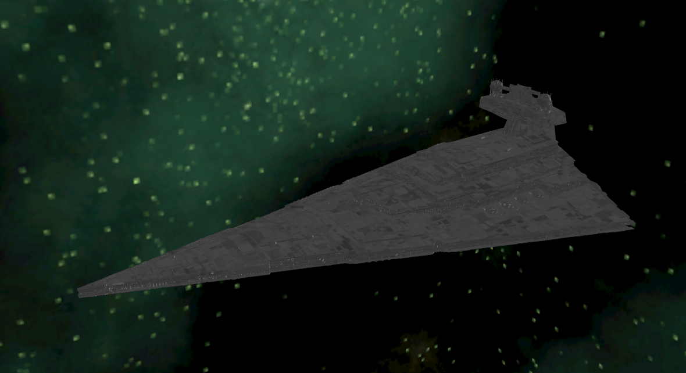

<!-- https://github.com/othneildrew/Best-README-Template -->
<a id="readme-top"></a>

<!-- PROJECT LOGO -->
<br />
<div align="center">
  <a href="https://github.com/Tuchila-Adi-Bogdan/utcn-OpenGL-StarwarsDemo">
    
  </a>
  
<h3 align="center">utcn-OpenGL-StarwarsDemo</h3>

  <p align="center">
    O simulăre 3D interactivă a unei bătălii spațiale, inspirată din universul "Star Wars". Implementată cu OpenGL.
    <br />
    Pentru materia PG (prelucrare grafica). 
    <br />
    <a href="https://github.com/Tuchila-Adi-Bogdan/utcn-OpenGL-StarwarsDemo/issues/new?labels=bug&template=bug-report---.md">Report Bug</a>
    &middot;
    <a href="https://github.com/Tuchila-Adi-Bogdan/utcn-OpenGL-StarwarsDemo/issues/new?labels=enhancement&template=feature-request---.md">Request Feature</a>
  </p>
</div>


<!-- TABLE OF CONTENTS -->
## 1. Cuprins
  
1. Cuprins
2. Prezentarea temei
3. Scenariul
   1. Descrierea scenei și a obiectelor
   2. Funcționalități
4. Detalii de implementare
   1. Funcții și algoritmi
      1. Soluții posibile
      2. Motivarea abordării alese
   2. Modelul grafic
   3. Structuri de date
   4. Ierarhia de clase
5. Prezentarea interfeței grafice utilizator / manual de utilizare
6. Concluzii și dezvoltări ulterioare
7. Referințe
   
<!-- ABOUT THE PROJECT -->
## 2. Prezentarea temei

Proiectul constă în realizarea unei simulări 3D interactive a unei bătălii spațiale, inspirată din universul "Star Wars". Scopul principal este demonstrarea conceptelor fundamentale de grafică computerizată utilizând biblioteca OpenGL și limbajul C++. Aplicația pune accent pe manipularea obiectelor 3D în timp real, iluminare dinamică, transformări geometrice complexe și animație procedurală. Scena surprinde confruntarea dintre Flota Imperială (incluzând Death Star II și Imperial Star Destroyers) și Alianța Rebelă (nave de tip X-Wing, A-Wing și Mon Calamari Cruisers), oferind utilizatorului control asupra camerei și asupra declanșării evenimentelor de luptă.

## 3. Scenariul
### Descrierea scenei și a obiectelor

#### Elemente Principale: 
Scena este plasată în spațiu adânc (Deep Space), randat prin intermediul unui Skybox cubic texturat.
#### 3.1 Descrierea scenei și a obiectelor 

1. Sursă de lumină globală: Există o sursă de lumină in spatele Death Star II.
2. The empire:
   1. Death Star II: Obiect masiv, parțial construit, poziționat în fundal.
   2. Imperial Star Destroyers (ISD): O formație de 7 nave capitale, dispuse în "V", care acționează ca platforme de tragere pentru utilizator.
3. Rebelii:
   1. Crucișătoare MC: Nave capitale care servesc drept ținte pentru Death Star.
   2. Flota de vânătoare (Fighters): Escadrile de X-Wings și A-Wings care execută manevre de atac și evaziune.
4. Elemente dinamice:
   1. Lasere verzi (Death Star și ISD).
   2. Lasere roșii (Nave rebele).
   3.	Explozii animate.

#### 3.2 Funcționalități
Aplicația permite:
-	Navigare liberă: Utilizatorul poate explora scena folosind o cameră de tip "Fly Camera".
-	Animație procedurală: Navele mici (X-Wings, A-Wings) nu stau statice; ele urmează o mașină de stări (State Machine) pentru a simula un atac: apropiere, viraj evaziv, fugă și regrupare.
-	Sistem de luptă interactiv:
-	Declanșarea "Superlaser-ului" Death Star asupra crucișătoarelor Mon Calamari.
-	Controlul turelelor de pe Star Destroyers (tastele 1-7) pentru a ataca ținte aleatorii din flota inamică.
-	"Volley Fire" din partea rebelilor (tasta P).
-	Manipularea timpului: Acțiunile se desfășoară doar cât timp tasta SPACE este apăsată, permițând vizualizarea detaliată a traiectoriilor laserelor și a detaliilor.

## 4. Detalii de implementare

### 4.1 Funcții și algoritmi
Funcționalitatea de bază se bazează pe bucla de randare (renderScene) și procesarea input-ului (processMovement).
- Algoritmul de mișcare a navelor : Pentru navele mici, s-a implementat un algoritm bazat pe Mașini de Stări Finite (FSM - Finite State Machine). Fiecare navă are o stare curentă (APPROACHING, EVASIVE_TURN, EVASIVE_RUN, STABILIZE, RETURNING, RESET_TURN).
  - La fiecare cadru, în funcție de stare, se actualizează poziția și rotația (Euler Angles).
  - Tranzițiile între stări se fac pe bază de cronometru (stateTimer) sau poziție (atingerea unei linii imaginare).
- Algoritmul de tragere (Targeting) : Pentru sistemul de lasere, s-a folosit un algoritm de selecție aleatorie a țintelor și interpolare liniară pentru mișcarea proiectilului:
  - CurrentPos = StartPos + (TargetPos - StartPos) * progress.
  - Când progress atinge 1.0, se consideră impact și laserul devine inactiv.
#### 4.1.1 Soluții posibile
-	Animație Keyframe (Hardcoded): Definirea manuală a fiecărei poziții la fiecare secundă.
- Motor Fizic: Implementarea vitezei, accelerației și a coliziunilor reale.
-	Procedural / State Machine: Definirea regulilor de comportament.

#### 4.1.2 Motivarea abordării alese
S-a ales abordarea Procedurală cu State Machine 
Motiv: Mașina de stări permite un comportament "organic" al flotei (navele par să reacționeze), menținând codul eficient și ușor de extins (se pot adăuga ușor noi stări).

### 4.2 Modelul grafic
Aplicația folosește OpenGL 3.3 Core Profile.
-	Pipeline de randare: Vertex Shader (transformă coordonatele din spațiul local -> lume -> vizualizare -> clip) și Fragment Shader (calculează culoarea finală).
-	Iluminare: Modelul Blinn-Phong.
    - Lumină direcțională pentru Soare.
    - Lumini punctiforme (Point Lights) dinamice atașate de vârful laserelor și de centrul exploziilor. Acestea apar și dispar în funcție de logica simulării.
- Texturare: Modelele 3D au coordonate UV și texturi difuze mapate.

### 4.3 Structuri de date
Pentru gestionarea eficientă a obiectelor, s-au folosit structuri C++ și containere STL:
- struct Ship: Stochează poziția (glm::vec3), rotația, viteza și starea curentă a fiecărei nave de luptă.
```
struct Ship {
    glm::vec3 position; // World Position
    glm::vec3 rotation; // Euler Angles: x=Pitch, y=Yaw, z=Roll
    float speed;        // Individual speed
    ShipState state = APPROACHING;
    float stateTimer = 0.0f;
};
```
- struct LaserShot / RebelLaserShot: Reține starea activă, progresul (0.0 - 1.0), poziția de start și un pointer către nava țintă (Ship* targetShip). Aceasta permite laserului să urmărească ținta chiar dacă nava se mișcă.
```
struct LaserShot {
    bool active = false;
    float progress = 0.0f;      // 0.0 = Start, 1.0 = Target
    glm::vec3 startPos;         // Origin
    Ship* targetShip = nullptr; // Target
};
```
```
struct RebelLaserShot {
    bool active = false;
    float progress = 0.0f;
    glm::vec3 startPos;
    int targetISDIndex; // Index 0-7 of the ISD array
};
```
- std::vector<Ship>: Gestionarea dinamică a flotelor (XWings, AWings).
- std::vector<RebelLaserShot>: Permite un număr variabil de proiectile simultane

### 4.4 Ierarhia de clase
Deși logica jocului este procedurală (în main.cpp), s-au folosit clase wrapper pentru abstractizarea OpenGL:
-	gps::Window: Inițializarea ferestrei GLFW și contextului OpenGL.
-	gps::Camera: Gestionează matricea de vizualizare (View Matrix), mișcarea (WASD) și rotația din mouse (Pitch/Yaw).
-	gps::Model3D: Încărcarea modelelor .obj folosind tiny_obj_loader și desenarea lor.
-	gps::Shader: Încărcarea, compilarea și link-area shaderelor GLSL.
-	gps::SkyBox: Clasa dedicată randării cubului de fundal.

## 5. Prezentarea interfeței grafice utilizator / Manual de utilizare

Interfața este vizuală, controlul realizându-se prin tastatură și mouse. Nu există meniuri 2D suprapuse (HUD), imersiunea fiind prioritară.
Controale:
-	W, A, S, D: Deplasare cameră (Înainte, Stânga, Înapoi, Dreapta).
- Mouse: Orientare privire.
-	Q / E: Rotația scenei pentru a observa umbrele/modelele din alte unghiuri.
-	SPACE (Apăsat):
    -	Activează curgerea timpului (navele se mișcă).
    -	Încarcă și trage cu Superlaser-ul Death Star.
- Tastele 1 - 7 (În timp ce ții SPACE): Fiecare tastă comandă un Star Destroyer specific să tragă un laser verde spre o navă rebelă aleatorie.
-	Tasta P (În timp ce ții SPACE): Comandă "Rebel Volley": Toate navele mici rebele trag simultan lasere roșii către distrugătoarele imperiale.
-	Tasta K: Resetarea completă a scenei (poziții nave, lasere, explozii).

## 6. Concluzii și dezvoltări ulterioare
Concluzii: Proiectul a reușit simularea unei scene complexe de luptă spațială, integrând cu succes concepte de transformări matriceale, iluminare dinamică (lasere care emit lumină) și inteligență artificială rudimentară pentru mișcarea flotelor. Utilizarea structurilor de date dinamice (std::vector) a permis scalarea numărului de nave fără a modifica logica de bază.

### Dezvoltări ulterioare:
Pentru a crește realismul aplicației, se pot implementa:
1.	Shadow Mapping: Implementarea umbrelor dinamice (navele să lase umbră una pe alta), folosind randarea în două treceri (Depth Map pass + Render pass).
2.	Coliziuni Avansate: Înlocuirea verificării simple (progress >= 1.0) cu volume de coliziune (AABB sau sfere) pentru a permite distrugerea navelor la impact.
3.	Sistem de Particule: Pentru a genera explozii volumetrice și urme ale motoarelor (engine trails).
4.	Audio: Adăugarea efectelor sonore spațiale 3D folosind o bibliotecă precum OpenAL.

## 7. Referințe:
1.	LearnOpenGL: https://learnopengl.com/ - Resursă principală pentru teorie (iluminare, transformări).
2.	GLM Documentation: https://glm.g-truc.net/ - Matematica vectorilor și matricelor.
3.	Star Wars 3D Models: sketchfab (https://sketchfab.com) - Sursa modelelor (Death Star, X-Wing, ISD).
4.	GLFW & GLEW Documentation: Pentru gestionarea ferestrei și a extensiilor OpenGL.

Project Link: [https://github.com/Tuchila-Adi-Bogdan/utcn-Investor_Centre](https://github.com/Tuchila-Adi-Bogdan/utcn-Investor_Centre)

<p align="right">(<a href="#readme-top">back to top</a>)</p>

<!-- MARKDOWN LINKS & IMAGES -->

[product-screenshot]: images/screenshot.png
